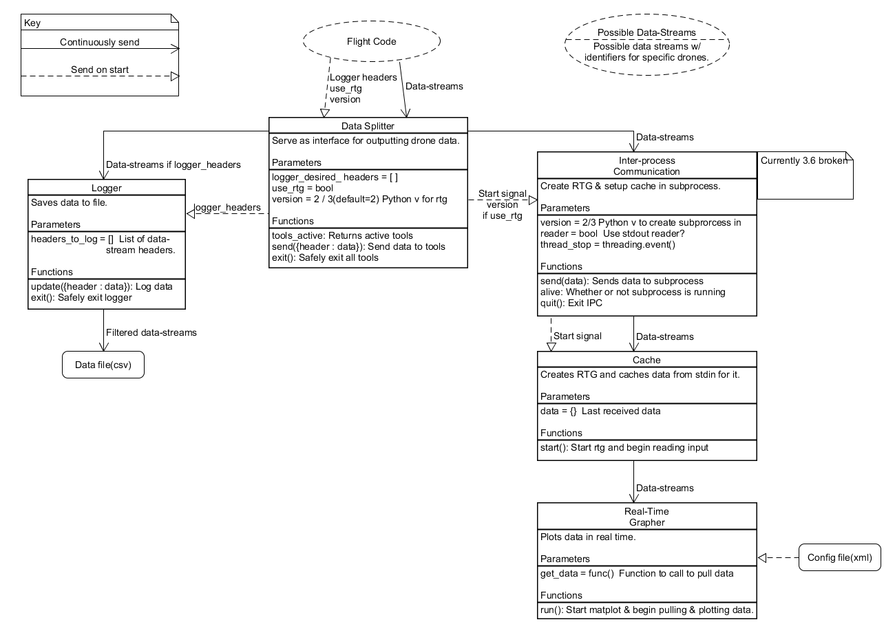

# Tools IARC-2019

## Data Splitter
Starts and sends data to both the logger and ipc(real time grapher).

More details in documentation/splitter/README.md

## Logger
Logs data as it comes in from the drone in real time.

More details in documentation/log/README.md

## Inter-process Communication
Creates and interacts with a subprocess. Currently used to keep the real_time_graphing process
separate from main due to matplotlib needing to be in main thread.

More details in documentation/ipc/README.md

## RTG Cache
Caches data for real time grapher. Meant to be used with Inter-process Communication.

__RTGCache.start()__ Call rtg.run() and begin reading input from stdin.

## Real Time Grapher
Graphs data as it comes in from drone in real time. Run with the inter-process communication.

More details in real_time_graph/README.md

# To be phased out
## Config Maker
Creates config files for RTG and Log Grapher.

More details in old_config_maker/README.md

## Plotter / Log Grapher
Graph data from generated log files. Requires a config file and csv data file.

More details in old_plotter/README.md

